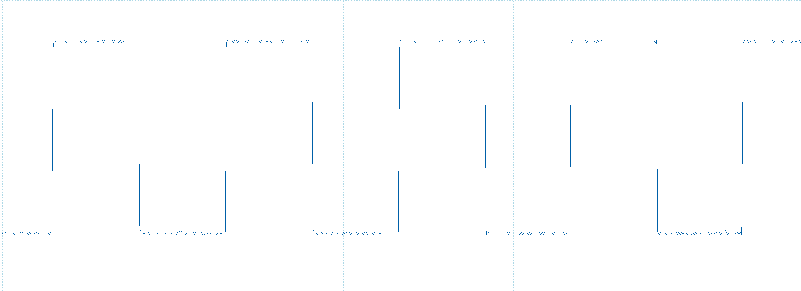

The RaspberryPi-GPIO-AutoSelect repository offers introductory examples for programmers new to Raspberry Pi GPIO programming. It showcases how to dynamically choose the correct GPIO chip across various Pi models, facilitating easier development for SPI applications and general GPIO use. These examples are meant to guide and inspire, allowing for adaptation and integration into diverse projects.

RaspberryPi-GPIO-AutoSelect is a Python script designed to automatically select the appropriate GPIO chip for various Raspberry Pi models. This utility facilitates seamless GPIO programming, especially for SPI applications, by dynamically identifying the Raspberry Pi model in use and adjusting GPIO chip selections accordingly. It's aimed at developers seeking a model-agnostic approach to GPIO manipulation, ensuring compatibility and performance across different Raspberry Pi versions.

Features
Automatically detects the Raspberry Pi model.
Selects the corresponding GPIO chip based on the model.
Simplifies SPI programming and general GPIO tasks.
Supports Raspberry Pi 3, 4, and 5 models.
Installation
Clone this repository to your local machine using:

RaspberryPi-GPIO-AutoSelect

This repository contains two Python scripts aimed at simplifying GPIO programming across different Raspberry Pi models. By dynamically identifying the Raspberry Pi model, these scripts automatically select the appropriate GPIO chip, making it easier for developers to interact with GPIO pins for various applications.

main.py - Basic GPIO Manipulation

The main.py script offers a straightforward demonstration of GPIO pin setup as inputs and outputs, making it an excellent starting point for those new to Raspberry Pi GPIO programming.

Features:

Dynamic detection of the Raspberry Pi model and selection of the corresponding GPIO chip.
Example of toggling an output pin (GPIO 22) to create a pulsing effect, suitable for blinking an LED or similar applications.
Configuration of additional GPIO pins as inputs with pull-up resistors, typical for buttons or switches.
Terminal Output:
When running the script, it outputs the detected Raspberry Pi model and the GPIO chip being used. For instance:

Model detected: Raspberry Pi 5 Model B Rev 1.0 The GPIO chip for this model is: gpiochip4

gpid-out-in-interrupt.py - Advanced GPIO Handling with Interrupts

Building upon main.py, the gpid-out-in-interrupt.py script introduces more complex GPIO handling capabilities, including monitoring input pins for state changes and implementing an interrupt-like routine.

gpid-out-in-interupt.py - additional Features:

Monitors GPIO 21 for state changes, printing the current state to the terminal only upon changes:
GPIO 21 is now: 1 GPIO 21 is now: 0

Monitors GPIO 20 Triggers an interrupt routine when GPIO 20 goes low, simulating an interrupt mechanism, printing the current state to the terminal only upon changes::
Interrupt on line 20

Continues the pulsing effect on GPIO 22, generating a square wave signal and demonstrating precise output control with a 0.01-second pulse length.
Oscilloscope Measurement for GPIO 22:

Oscilloscope Measurement for GPIO 22:

Usage:

To use these scripts, clone the repository to your Raspberry Pi and run the desired script. Ensure you have connected the necessary peripherals to observe the script's behavior.

Contributing:

Contributions are encouraged to enhance or expand the scripts' functionalities. Fork the repository, apply your changes, and submit a pull request for review.

License:

This project is made available under the MIT License, permitting free usage and modification of the scripts.

Contact:

For questions or feedback, please reach out to Claudius Viviani at cv@ntx.ch.

